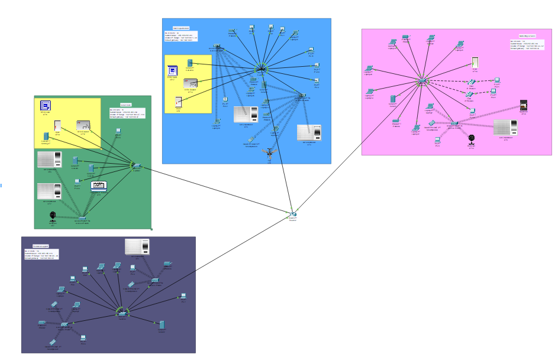
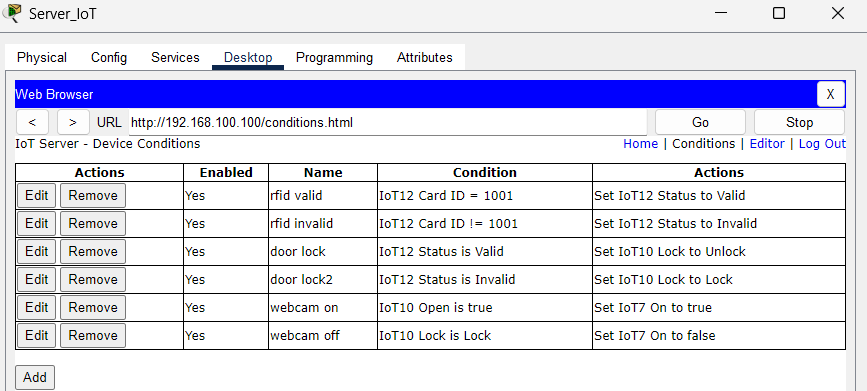
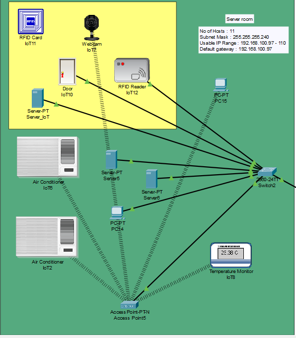
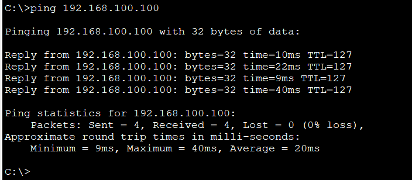

# Multi-Branch Network Design — CodeLink Solutions (Penang Branch)

Design and configuration of a branch office network for a fictional IT company, built in **Cisco Packet Tracer**. The branch uses **VLSM subnetting**, wired and wireless access, and an **IoT RFID access-control system** for restricted areas.

> **Group assignment:** this was a group project with four members, where each member designed and built **one branch** of the company (Kuala Lumpur, Penang, Johor Bahru and Kota Kinabalu). The branches were then connected over a WAN. **This repository focuses on my part — the Penang branch.** The full group report and the combined topology are included for context.



| | |
|---|---|
| **Project type** | University group project — *Introduction to Networking* |
| **Team** | 4 members (one branch each) |
| **My part** | Penang branch — design, IP addressing, device configuration, IoT security system, testing |
| **Tools** | Cisco Packet Tracer 9.0, Cisco IOS |
| **Scale (my branch)** | 1 router · 4 switches · 6 access points · 70+ end devices and IoT sensors |

---

## The Scenario

CodeLink Solutions is a fictional software development and IT consulting company with offices in four Malaysian cities. It needs a reliable and secure network for daily work, file sharing and access to central resources. Each team member was responsible for designing one branch.

## My Penang Branch

The Penang branch has four departments, each on its own subnet and switch, connected to a central branch router:

| Department | Hosts needed | Subnet | Mask | Gateway | Usable range |
|---|---|---|---|---|---|
| R&D | 23 | 192.168.100.0/27 | 255.255.255.224 | 192.168.100.1 | .1 – .30 |
| Marketing & Sales | 19 | 192.168.100.32/27 | 255.255.255.224 | 192.168.100.33 | .33 – .62 |
| Technical Support | 16 | 192.168.100.64/27 | 255.255.255.224 | 192.168.100.65 | .65 – .94 |
| Server Room | 11 | 192.168.100.96/28 | 255.255.255.240 | 192.168.100.97 | .97 – .110 |
| Router link | 2 | 192.168.100.112/30 | 255.255.255.252 | — | .113 – .114 |
| Future expansion | — | 192.168.100.120/27 | 255.255.255.224 | — | .121 – .150 |

**Why VLSM instead of fixed-size subnets:** each department gets a subnet sized to its real host count plus room to grow, which avoids wasting address space and leaves a full /27 free for future expansion.

### What I configured

- **Router** — gateway interface for every department subnet, plus serial WAN links and static routes to the other three branches
- **Switches** — management IP and default gateway on each department switch
- **End devices** — static IP, subnet mask and gateway on PCs, laptops, servers, printers and IP phones
- **Wireless** — access points with WPA2-PSK so staff laptops and smartphones can connect
- **Testing** — ping tests from every department to confirm connectivity

### IoT Physical Security — RFID Access Control

The **R&D department** and the **Server Room** are protected by an RFID access-control system managed by an IoT server:

- An **RFID reader** checks the card ID against the rules on the IoT server. Only an authorised card (for example ID `1001` in the Server Room) is marked *Valid*.
- A valid card **unlocks the door**; an invalid card keeps it **locked**.
- In the Server Room, a **webcam turns on automatically when the door opens** and turns off when it locks, recording who enters.
- Air conditioners and a temperature monitor keep the server room environment under control.



| Server room layout | Connectivity test |
|---|---|
|  |  |

---

## The Wider Group Network

All four branch routers are connected in a **full mesh of serial WAN links** (`10.0.0.0/30` point-to-point subnets) using **static routes**, so every branch can reach every other branch.

| Branch | LAN range | Designed by |
|---|---|---|
| Kuala Lumpur | 192.168.20.0/24 | Muhammad Wijdan |
| **Penang** | **192.168.100.0/24** | **Omar Mohammed Mahdi Mahdi** |
| Johor Bahru | 192.168.30.0/24 | Saleh Mohammed Saleh Hasan |
| Kota Kinabalu | 192.168.40.0/24 | Kamal Ashraf Kamal Hassan |

---

## Looking Back — What I Would Do Differently

This was one of my first networking projects. With what I have learned since (see my later project **enterprise-network-security-cisco**)<!-- TODO (Omar): after uploading, turn the project name into a link: https://github.com/YOUR-USERNAME/enterprise-network-security-cisco -->, I would harden this design:

| Current design | Improvement |
|---|---|
| One physical switch per department, all on VLAN 1 | VLANs with 802.1Q trunks, and a separate management VLAN |
| No console/enable passwords, `no service password-encryption` | `enable secret`, console/VTY authentication, SSH only, password encryption |
| IoT devices share the same subnet as staff PCs | Dedicated IoT VLAN with ACLs so a compromised sensor can't reach user devices |
| WPA2-PSK with a shared key | WPA2/WPA3-Enterprise (802.1X) with per-user credentials |
| Static routes in a full mesh | A dynamic routing protocol such as OSPF for automatic failover |
| No Layer 2 protections | Port security, DHCP snooping, Dynamic ARP Inspection, BPDU Guard |

---

## Repository Structure

```
codelink-multi-branch-network-design/
├── configs/
│   └── penang-branch/          # running-config of the Penang router and 4 switches
├── docs/
│   ├── Penang_Branch_Report_Omar.pdf     # my individual section (39 pages)
│   └── CodeLink_Full_Group_Report.pdf    # full group report, all four branches
├── images/
└── packet-tracer/
    ├── Penang_Branch_Omar.pkt            # my branch on its own
    └── CodeLink_All_Branches.pkt         # combined topology of all four branches
```

## How to Explore

- **No Packet Tracer?** Read the device configurations in [`configs/penang-branch/`](configs/penang-branch/) and the report in [`docs/`](docs/).
- **With Packet Tracer:** open the `.pkt` files in Cisco Packet Tracer **9.0 or later**.

## Skills Demonstrated

`Network design` `VLSM subnetting` `Cisco IOS` `Router & switch configuration` `Wireless access points` `IoT integration` `Physical access control` `Static routing` `Connectivity testing` `Technical documentation`

## Team

- Muhammad Wijdan — Team Leader (Kuala Lumpur branch)
- **Omar Mohammed Mahdi Mahdi** — Penang branch
- Saleh Mohammed Saleh Hasan — Johor Bahru branch
- Kamal Ashraf Kamal Hassan — Kota Kinabalu branch

---

*Academic project completed at Asia Pacific University of Technology & Innovation (APU), 2025. CodeLink Solutions is a fictional company created for the assignment.*
